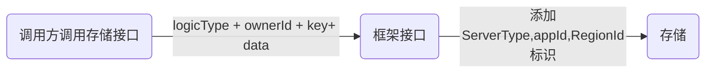

# 存储规范文档
## 简介
```text
    homo框架的统一存储程序，所有homo服务器的数据由落地程序统一落地
``` 
## 目的
- 服务间可共用存储资源,需要规范存储来方便区分和处理各个服务所使用的数据.
## 前提
- 基于homo-core的存储框架

## 版本
- homo-core >= 1.0

## 使用说明
```text
1：工程依赖
    例：使用mysql的落地程序
    <dependency>
            <groupId>com.homo</groupId>
            <artifactId>homo-service-storage-dirty</artifactId>
        </dependency>
        <dependency>
            <groupId>com.homo</groupId>
            <artifactId>homo-service-mysql-landing</artifactId>
    </dependency>
2：声明是一个落地程序
  例：在启动类上加上@DirtyLandingServer注解标注这是一个落地程序
```
 

## 存储维度说明

| 存储维度   | 说明                                                         | 定义方式                 |
| ---------- | ------------------------------------------------------------ | ------------------------ |
| appId      | 应用id | apollo配置|
| regionId   | 区服id                                                       | apollo配置               |
| logicType  | 业务层自定义维度                                             | 接口传入                 |
| ownerId    | 业务层自定义维度                                             | 接口传入                 |


## 流程



## 接口设计

```java
public interface StorageDriver extends Driver {

  /**
   * 通过key列表获取value
   * @param appId     appid
   * @param regionId  regionId
   * @param logicType 逻辑类型
   * @param ownerId   ID
   * @param fieldList key列表
   */
  Homo<Map<String, byte[]>> asyncGetByFields(String appId, String regionId, String logicType, String ownerId, List<String> fieldList);

  /**
   * 获得所有key 和 value
   *
   * @param appId     appid
   * @param regionId  regionId
   * @param logicType 逻辑类型
   * @param ownerId   ID
   */
  Homo<Map<String, byte[]>> asyncGetAll(String appId, String regionId, String logicType, String ownerId);
  /**
   * 更新多key,value数据，通过回调返回详细结果
   *
   * @param appId     appid
   * @param regionId  regionId
   * @param logicType 逻辑类型
   * @param ownerId   ID
   * @param data 待保存数据
   */
  Homo<Pair<Boolean, Map<String, byte[]>>> asyncUpdate(String appId, String regionId, String logicType, String ownerId, Map<String, byte[]> data);

  /**
   * 增加key列表的值
   * @param appId     appid
   * @param regionId  regionId
   * @param logicType 逻辑类型
   * @param ownerId   ID
   * @param incrData 指定key的值列表
   */
  Homo<Pair<Boolean, Map<String, Long>>> asyncIncr(String appId, String regionId, String logicType, String ownerId, Map<String, Long> incrData);
  /**
   * 删除key列表的值(逻辑删除)
   * @param appId     appid
   * @param regionId  regionId
   * @param logicType 逻辑类型
   * @param ownerId   ID
   * @param remKeys 指定key的值列表
   */
  Homo<Boolean> asyncRemoveKeys(String appId, String regionId, String logicType, String ownerId, List<String> remKeys);
}
```

### 数据结构

```java
public class ServerInfo {
  /**
   * 应用id
   */
  public String appId = "1";
  /**
   * 区服id
   */
  public String regionId = "1";
  /**
   * 命名空间
   */
  public String namespace = "1";
  /**
   * 渠道id
   */
  public String channel = "*";
  /**
   * 服务名
   */
  public String serverName ;
  /**
   * 是否是有状态服务器
   */
  public boolean isStateful;
}
```


## 基于Redis和mySql的落地程序
 
### 设计思路
* 1数据会按照指定格式进行存储到hSet中，该hSet称之为ownerKey,其中的filed称之为logicKey, 其中一个cachedAllKey（field）标识该key上的所有field都已加载进内存中
  存储流程：先存redis，再由另一台落地程序定时将redis上的数据落地到mysql
  存储规则： 当调用update或incr更新数据时，会在redis上打个不过期的string类型标签，标志该key
 存在在mysql（existKey）existKey用于判断数据是否是存在的
* 2当调用get方法获取数据时，如果redis没有数据，会通过existKey判定是否要从mysql加载数据，
* 3如果存在existKey,就进行数据加热操作（hotkey），不存在则直接返回
* 4从mysql获取到数据后，会将其存入到redis中（数据结构是hSet），然后重新执行get方法从redis获取数据.
 与此同时会在数据结构上增加一个field标识(成员名为cacheKey)，cacheKey用于判断数据是否存在于redis，存在才会从redis获取数据
  如果cacheKey存在，就从redis捞取后返回，如果不存在，则执行步骤3
* 5数据移除会将需要移除的数据迁移到hSet的另一个字段上（logicKey+:+del）（逻辑删除）,然后原先的logicKey的值会被打上删除标记（:delFlag标识）
   

- 记录结构

  | 列名          | 说明                 | 结构                                         |
    | ------------- | -------------------- | -------------------------------------------- |
  | primary_key   | 主键,用于索引特定key | <logic_type>+":" + <onwer_id>+ ":" + \<key\> |
  | logic_type    | 记录字段             | 业务自定义                                   |
  | owner_id      | 记录字段             | 业务自定义                                   |
  | key           | 数据key              | 业务自定义                                   |
  | value         | 存储数据             | 业务自定义                                   |
  | is_del        | 是否删除标志         | 0-未删除,1-已删除                            |
  | query_all_key | 记录字段             | <logic_type> + ":" + <owner_id>              |

###定制化
- 存储方式可选配置
```java
public class DirtyProperties {
    /**
     * 脏表数量，最佳实践是一个pod维护一个脏表
     */
    @Value("${homo.dirty.tableNum:1}")
    private int tableNum;

    /**
     * 落地表前缀名
     */
    @Value("${homo.dirty.table.prefix:dirtyKey}")
    private String tablePrefix;

    /**
     * 锁超时时间
     */
    @Value("${homo.dirty.lock.expireTime:1000}")
    private Integer lockExpireTime;

    /**
     * 快照表前缀名，快照表用于写时复制
     */
    @Value("${homo.dirty.snapshot.suffix:saving}")
    private String snapshotSuffix;

    /**
     * 异常表前缀，异常表用于存储落地失败的数据，供后期数据恢复
     */
    @Value("${homo.dirty.lock.error.suffix:error}")
    private String errorSuffix;

    /**
     * 批量落地数，默认一次落地1000条数据
     */
    @Value("${homo.dirty.landing.batchNum:1000}")
    private String batchNum;

    /**
     * 落地间隔时间
     */
    @Value("${homo.dirty.landing.delayTime:10}")
    private long delayTime;
}
```
