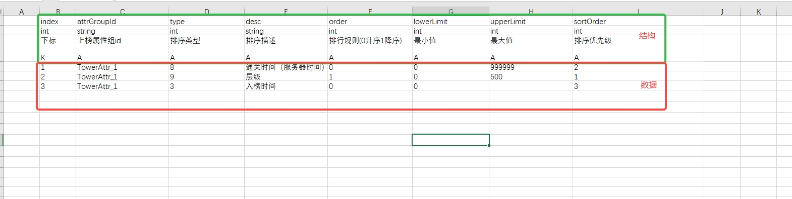

# homo-maven-plugin 一键部署模块说明文档
## 一、模块概述
homo-maven-plugin 是一个 Maven 插件项目，旨在为项目提供一系列自定义的构建、部署和清理等功能。它借助 Maven 的扩展机制，在项目构建过程中集成了丰富的特性，如配置管理、服务加载、模板生成以及容器化部署等。
## 二、环境
- 依赖homo-core开发  
## 二、主要功能
### 1. homoTurnTable
- 功能 ：用于生成业务使用的表，并将表数据映射成对象实例
- 以下是配置表的通用配置格式： 

#### 代码数据结构（顶部四行）

+ 字段名
+ 数据类型
    + int：整型
    + string：字符串
    + bool：布尔类型
    + float：浮点型
    + long：长整型
    + 枚举（必须小e开头如：eTimeType）
    + `Map<T>`（T可以为以上任务数据类型）
    + `List<T>`（T可以为以上任务数据类型）
    + JSON
+ 注释
+ 标记
    + S：服务器需要的字段
    + C：客户端需要的字段
    + A：服务端和客户端都需要的代码
    + K：key值，数据类型必须为int

#### 最左边第一列 
用N表示不需要读取的数据 

## 三、使用方法
### 1. 引入插件
在项目的 pom.xml 中引入 homo-maven-plugin ：
```xml
<plugin>
    <groupId>com.homo</groupId>
    <artifactId>homo-maven-plugin</artifactId>
    <version>${homo.core.version}</version>
    <executions>
        <execution>
            <id>homoTurnTable</id>
            <goals>
                <goal>homoTurnTable</goal>
            </goals>
            <configuration>
                <fltPath>E:\homo-game\Turn_table\ftl</fltPath>
                <javaPath>E:\homo-game\homo-game-test\homo-turntable-test\src\main\java\com\homo\turntable\data</javaPath>
                <packageName>com.homo.turntable.data</packageName>
                <dataPath>E:\homo-game\Turn_table\homo_turntable_test</dataPath>
                <jsonPath>E:\homo-game\homo-game-test\homo-turntable-test\src\main\resources\json</jsonPath>
                <codeType>.java</codeType>
                <filter>S</filter>
                <suffix>xlsx</suffix>
            </configuration>
        </execution>
    </executions>
</plugin>
```
### 2. 主要配置介绍
- fltPath ：ftl生成模板（自定义ftl模板路径，不指定默认生成自带的模板）
- javaPath ：生成的java类路径
- packageName ：生成的类的包名（必填）
- dataPath ：excel表路径（必填）
- jsonPath：生成的json文件路径（必填）
### 3. 示例
- 配置表格式


- 导出的java类，生成的类是个Bean，使用时通过@Autowire自动注入，并调用load()将json配置加载进内存。
```java
package com.homo.turntable.data;

import com.alibaba.fastjson.JSON;
import com.alibaba.fastjson.JSONObject;
import com.alibaba.fastjson.parser.Feature;
import com.homo.core.utils.lang.Pair;
import lombok.Data;
import lombok.Getter;
import org.slf4j.Logger;
import org.slf4j.LoggerFactory;
import org.springframework.stereotype.Component;

import java.io.BufferedReader;
import java.io.IOException;
import java.io.InputStream;
import java.io.InputStreamReader;
import java.util.*;
import java.util.function.Predicate;
import java.util.stream.Collectors;

@Component
public class Table_ActivityInfo  {
	private final static Logger logger = LoggerFactory.getLogger(Table_ActivityInfo.class);
	public static String META_INFO = "__META_INFO__"; 

	public static int ROW_OFFSET = 4;

	public Table_ActivityInfo() {}
  
    public void load(){ }
  
	@Data
	public static class Record_ActivityInfo{
                //仅展示部分示例属性
		public int __ROW_INDEX__;
			/**
			* 下标
			*/
						public final Integer index;
			/**
			* 活动id
			*/
						public final String actId;
			/**
			* 活动类型
			*/
						public final Integer actType;
			/**
			* 活动子类型
			*/
						public final Integer actSubType;
			/**
			* 是否热点活动
			*/
						public final Integer actHot;
             
		public String getKey__tpf() {
				String __key__ = index + "";
			return __key__;
		}
	}

	 //省略工具方法
}
```
- 导出的json文件
```json 
{
  "__META_INFO__": [
    {
      "1": "index",
      "2": "actId",
      "3": "actType",
      "4": "actSubType",
      "5": "actHot",
      "6": "actName_i2",
      "7": "actName",
      "8": "tradeType",
      "9": "actDesc_i2",
      "10": "actDesc",
      "11": "actShortDesc",
      "12": "sortId",
      "13": "openConditionMark",
      "14": "finishGuideShow",
      "15": "actPosCenter",
      "16": "defaultRedPoint",
      "17": "actIcon",
      "18": "cornerMarkType",
      "19": "joinType",
      "20": "startTime",
      "21": "endTime",
      "22": "closeTime",
      "23": "startTimeStr",
      "24": "endTimeStr",
      "25": "closeTimeStr",
      "26": "registerTimeAfterOpen",
      "27": "registerTimeBeforeOpen",
      "28": "showConditionType",
      "29": "showConditionValue",
      "30": "channel",
      "31": "extParams",
      "32": "enable",
      "33": "luaPath",
      "34": "resPath",
      "35": "luaName",
      "36": "subResPath",
      "37": "fullscreen"
    },
    {
      "1": "int",
      "2": "string",
      "3": "int",
      "4": "int",
      "5": "int",
      "6": "string",
      "7": "string",
      "8": "string",
      "9": "string",
      "10": "string",
      "11": "string",
      "12": "int",
      "13": "string",
      "14": "int",
      "15": "int",
      "16": "int",
      "17": "string",
      "18": "int",
      "19": "int",
      "20": "string",
      "21": "string",
      "22": "string",
      "23": "string",
      "24": "string",
      "25": "string",
      "26": "long",
      "27": "long",
      "28": "int",
      "29": "int",
      "30": "string",
      "31": "string",
      "32": "int",
      "33": "string",
      "34": "string",
      "35": "string",
      "36": "string",
      "37": "int"
    },
    {
      "1": "下标",
      "2": "活动id",
      "3": "活动类型",
      "4": "活动子类型",
      "5": "是否热点活动",
      "6": "活动名称",
      "7": "活动名称",
      "8": "数据上报打点类型(已弃用)",
      "9": "活动描述",
      "10": "活动描述",
      "11": "活动简要描述",
      "12": "优先级",
      "13": "开启条件标记",
      "14": "是否完成新手引导后才显示",
      "15": "活动所在位置",
      "16": "本地默认红点数",
      "17": "活动Icon",
      "18": "角标",
      "19": "开启类型",
      "20": "开启时间",
      "21": "结算时间",
      "22": "关闭时间",
      "23": "开启时间",
      "24": "结算时间",
      "25": "关闭时间",
      "26": "在该时间后注册才开启",
      "27": "在该时间前注册才开启",
      "28": "展示条件类型",
      "29": "展示条件值",
      "30": "支持渠道",
      "31": "活动额外参数",
      "32": "总开关",
      "33": "lua脚本路径",
      "34": "预制资源路径",
      "35": "lua脚本名称",
      "36": "子预制体资源路径",
      "37": "是否全屏"
    },
    {
      "1": "K",
      "2": "A",
      "3": "A",
      "4": "A",
      "5": "A",
      "6": "A",
      "7": "A",
      "8": "N",
      "9": "A",
      "10": "A",
      "11": "C",
      "12": "A",
      "13": "S",
      "14": "C",
      "15": "C",
      "16": "C",
      "17": "C",
      "18": "A",
      "19": "A",
      "20": "A",
      "21": "A",
      "22": "A",
      "23": "C",
      "24": "C",
      "25": "C",
      "26": "A",
      "27": "A",
      "28": "A",
      "29": "A",
      "30": "A",
      "31": "A",
      "32": "A",
      "33": "A",
      "34": "A",
      "35": "A",
      "36": "A",
      "37": "A"
    }
  ],
  "1": {
    "__ROW_INDEX__": 4,
    "index": 1,
    "actId": "1",
    "actType": 1,
    "actSubType": 0,
    "actHot": 0,
    "actName_i2": "UI/Active_name_1",
    "actName": "关注有礼",
    "actDesc_i2": "UI/Active_name_1D",
    "actDesc": "<color=#FFC900>关注有礼：\n</color>1.关注微信公众号“霓虹深渊无限手游”\n2.点击菜单栏【新手福利】并输入口令\n3.返回此活动页面即可领取礼包",
    "sortId": 7,
    "openConditionMark": "",
    "cornerMarkType": 1,
    "joinType": 2,
    "startTime": "1661345551",
    "endTime": "1974902400",
    "closeTime": "",
    "registerTimeAfterOpen": 0,
    "registerTimeBeforeOpen": 0,
    "showConditionType": 0,
    "showConditionValue": 0,
    "channel": "2,101,3",
    "extParams": "",
    "enable": 1,
    "luaPath": "UI.Activites.UIActWeChat",
    "resPath": "UI/Activity/Prefab/ActFrame/UIActWeChat.prefab",
    "luaName": "",
    "subResPath": "",
    "fullscreen": 0
  },
  "2": {
    "__ROW_INDEX__": 5,
    "index": 2,
    "actId": "2",
    "actType": 2,
    "actSubType": 0,
    "actHot": 1,
    "actName_i2": "UI/Active_name_2",
    "actName": "小心火烛限时开启",
    "actDesc_i2": "UI/Active_name_2D",
    "actDesc": "活动时间：11月24日0:00-12月14日23:59\n\nUP纪念品：爆米花-啪啪啪！所有的子弹会产生爆炸效果。请开始你的表演！\n             爆破装置5000-爆炸效果变为X型爆炸。\n             十字爆破装置-爆炸效果变为十字型爆炸。\n\n活动规则：活动期间内，UP扭蛋机上述纪念品获得概率大幅提升。",
    "sortId": 4,
    "openConditionMark": "",
    "cornerMarkType": 1,
    "joinType": 2,
    "startTime": "1669219200",
    "endTime": "1671033599",
    "closeTime": "",
    "registerTimeAfterOpen": 0,
    "registerTimeBeforeOpen": 0,
    "showConditionType": 0,
    "showConditionValue": 0,
    "channel": "2,101,3,52,16,11,12,13,14,30,102,26,40,350007,53,54,4",
    "extParams": "100604;100807;100808",
    "enable": 1,
    "luaPath": "UI.Activites.UIActLimitTimeVending",
    "resPath": "UI/Activity/Prefab/Box_UIActivities_vending.prefab",
    "luaName": "",
    "subResPath": "UI/Activity/Prefab/ActFrame/WidgetVendingPoster.prefab;UI/Card/Prefab_detail/vending_detail_partTitle_2.prefab;UI/Card/Prefab_detail/ActFrame/vending_detail_partText_2.prefab",
    "fullscreen": 0
  }

}

```
## 四、注意事项
- 如果指定了<execution><id>,生成时注意带上id，如homo:homoTurnTable@homoTurnTable -f pom.xml

<span style="font-size: 20px;">[返回主菜单](../../README.md)